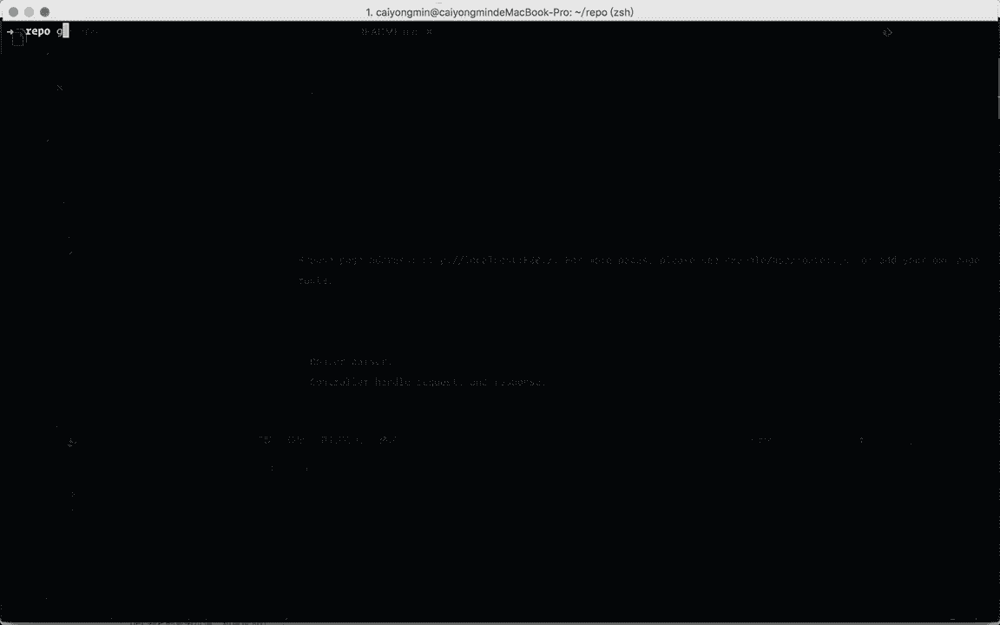

# tiny-egg

A minimum implementation version of [egg.js](https://eggjs.org/zh-cn/).

## Run

```bash
# clone project
git clone git@github.com:caiyongmin/tiny-egg.git

# install dependencies
npm run bootstrap

# run demo
npm run demo
```

Browse page address: http://localhost:8001/. For more pages, please see example/app/router.js, or add your own page route.



## Features

- Router parser.
- Controller handle request, and response.

## Todos

- [x] Controller needs to continue to do well.
- [x] Support load service.
- [x] Support load middleware.
- [x] Support load config.
- [x] Support load app/ctx/request/response/helper extend.
- [x] Support load plugin.
  - Temporary, only middleware plugins are supported.

## Directory structure

```
.
├── example                       # 项目示例
│   ├── app
│   │   ├── controller            # 控制器
│   │   │   └── page.js
│   │   ├── extend                # 扩展
│   │   │   ├── application.js
│   │   │   ├── context.js
│   │   │   ├── helper.js
│   │   │   ├── request.js
│   │   │   └── response.js
│   │   ├── middleware            # 中间件
│   │   │   └── robot.js
│   │   ├── router.js             # 路由
│   │   └── service               # 服务
│   │       └── page.js
│   ├── app.js                    # 应用初始化
│   ├── config                    # 配置
│   │   ├── config.default.js
│   │   └── plugin.js
│   ├── lib                       # 插件
│   │   └── plugin
│   │       └── egg-static-cache
│   ├── package.json
│
├── packages                            # egg.js 框架，包含 egg-core 和 egg
│   ├── egg
│   │   ├── application.js
│   │   ├── egg.js                      # 应用基础类
│   │   ├── index.js
│   │   ├── loader
│   │   │   └── app_worker_loader.js    # 加载器
│   │   ├── package.json
│   │   └── utils
│   │       └── base_context_class.js   # Controller、Service 等的基础类
│   └── egg-core
│       ├── index.js
│       ├── egg_core.js                 # eggCore 基础类
│       ├── loader
│       │   ├── egg_loader.js           # eggCore 加载器
│       │   └── mixins
│       │       ├── config.js           # 加载配置
│       │       ├── controller.js       # 加载控制器
│       │       ├── extend.js           # 加载扩展
│       │       ├── middleware.js       # 加载中间件
│       │       ├── plugin.js           # 加载插件
│       │       ├── router.js           # 加载路由
│       │       └── service.js          # 加载服务
│       ├── utils
│       │   ├── base_context_class.js   # eggCore 基础类
│       │   ├── basic.js                # 基础工具库
│       │   ├── context_loader.js       # eggCore contextLoader 加载器，继承自 fileLoader
│       │   ├── file_loader.js          # eggCore fileLoader
│       │   └── router.js               # 路由基础类
│       ├── package.json
│       └── yarn.lock
├── LICENSE
├── README.md
├── jest.config.js
├── package.json
└── yarn.lock
```
